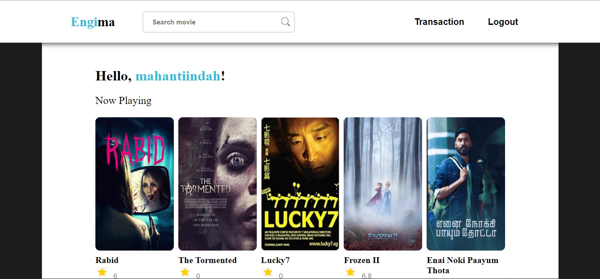
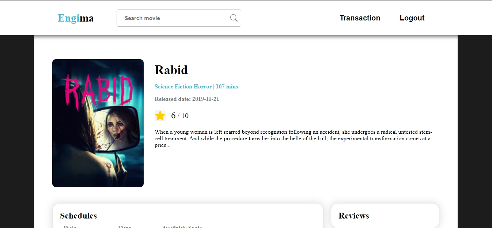
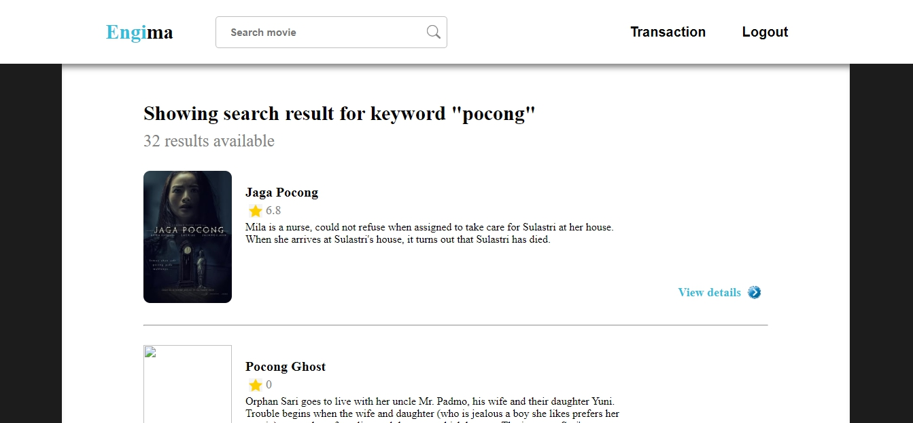

# Engima

## URL : http://ec2-34-216-207-246.us-west-2.compute.amazonaws.com/engima/html/login.html

## Deskripsi Aplikasi Engima

Aplikasi web ini merupakan salah satu contoh aplikasi web untuk membeli tiket bioskop yang diimplementasikan secara sederhana. Dalam aplikasi web ini selain apat membeli tiket,  pengguna dapat melihat film yang sedang tayang hari ini. Pengguna juga dapat mencari film yang suda berlalu. Selain itu, pengguna juga dapat mengulas film yang sudah ia tonton. Pengguna juga tentunya dapat melihat ulasan yang sudah ditulis oleh pengguna lainnya. Pengguna memasuki aplikasi web ini dengan mendaftar sebagai pengguna sehinggan masing-masing pengguna akan mempunyai akun pengguna.

## Basis Data

Tabel film tidak diperlukan, tabel ticket untuk mencatat transaksi tidak diperlukan

## Pembagian Tugas

1. Halaman Transaction History 135170585
2. Halaman Film Details 13517085
3. MovieDB API 13517013
4. Home 13517013
5. Search 13517013
6. CI / CD : 13517013, 13517085 
7. Testing : 13517085 
8. Explore AWS : 13517013