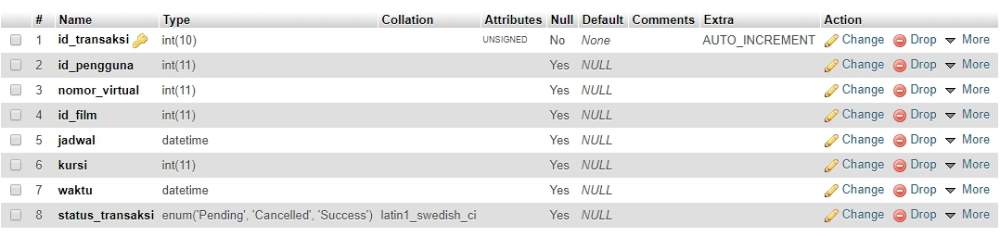

## Url Deployment : http://ec2-52-43-105-247.us-west-2.compute.amazonaws.com/

# WS-Transaksi

## Deskripsi WS Transaksi
Web service ini bertanggung jawab untuk semua transaksi tiket film Engima. Web service Transaksi memiliki basis data tersendiri yang memiliki informasi transaksi tiket film setiap pengguna Engima. Informasi transaksi adalah id pengguna, nomor akun virtual tujuan, id film, jadwal film, kursi yang dipesan, waktu pembuatan transaksi, dan status transaksi.

## Basis Data

## Pembagian Tugas DPPL ##
1. CI/CD: 13517013, 13517025, 13517085
2. Eksplorasi AWS: 13517013
3. Testing: 13517013, 13517025, 13517085